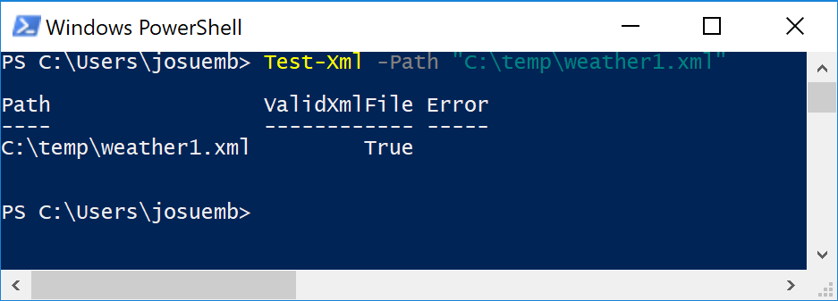
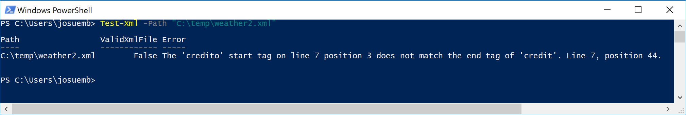

# HumanTechSolutions.PowerShell.XmlUtils
Some common XML Utils I created because it was useful in my daily job and to get some Powershell fun as well.
## Installation
You install by using:
[PowerShellGallery](https://www.powershellgallery.com/)
```powershell
Install-Module -Name "HumanTechSolutions.PowerShell.XmlUtils"
```
See more at:
https://www.powershellgallery.com/packages/HumanTechSolutions.PowerShell.XmlUtils/1.0
## Import
If you just want to import it for "temporary" use, you can do it by using:
```powershell
HumanTechSolutions.PowerShell.XmlUtils-Import.ps1
```
Which is provided with the module.
## Testing
I am including [Pester](https://github.com/pester/Pester/) tests in the file: [HumanTechSolutions.PowerShell.XmlUtils.tests.ps1](https://github.com/josuemb/HumanTechSolutions.PowerShell.XmlUtils/blob/master/HumanTechSolutions.PowerShell.XmlUtils/Tests/HumanTechSolutions.PowerShell.XmlUtils.tests.ps1)
You can run it by doing:
```powershell
Invoke-Pester ".\HumanTechSolutions.PowerShell.XmlUtils.tests.ps1"
```
## Source Code
You can get it from Github:

https://github.com/josuemb/HumanTechSolutions.PowerShell.XmlUtils

Do a pull request. It will be welcome.
## License
We are using [Apache License 2.0](http://www.apache.org/licenses/LICENSE-2.0)

See our licence file:
[LICENSE](https://github.com/josuemb/HumanTechSolutions.PowerShell.XmlUtils/blob/master/LICENSE)
## Cmdlets
### Test-Xml
Test a given XML file for errors.
#### Cmdlet execution examples:
Different ways to test if file "c:\temp\myxmlfile.xml" have some errors:
```powershell
Test-Xml -Path "c:\temp\myxmlfile.xml"
Test-Xml -FullName "c:\temp\myxmlfile.xml"
Test-Xml "c:\temp\myxmlfile.xml"
```
#### Cmdlet output examples:
File without errors:



File with errors:


